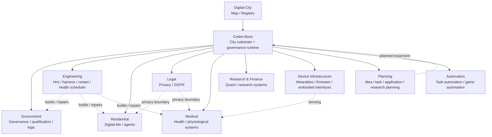

# Digital City

> **City map for the connected digital ecosystem.**
>
> Digital-City is the navigation, registry, and integration map for the GitHub projects that form the wider ecosystem around **Codex-Boss**. It is intentionally **not** a monorepo and does not duplicate the source code of connected projects.

## City model

The repository uses one simple mapping:

- **City / 地基与城市运行层** → Codex-Boss
- **Building type / 建筑类型** → first-level directory in this repository
- **Building / 楼栋** → one connected GitHub project
- **Room / 房间** → a capability exposed by that project
- **Road / 道路** → a supported cross-project interface, event, dependency, or data flow
- **Bridge / 廊桥** → a higher-level cross-project integration
- **Municipal Hall / 市政厅** → governance, learning, and evolution mechanisms
- **Engineering works / 工务系统** → Hns and operational tooling
- **Resident / 居民** → a persistent digital identity or agent, such as Digital-Me

The key boundary is:

> **Boss is the city substrate, not the largest building in the city.**

New functionality should therefore be classified before it is added: is it city infrastructure, a building, a room inside an existing building, a resident, or a road between them?

---

## City map

---

## Building directory

| Building type | City role | Connected projects | Main capabilities |
|---|---|---|---|
| [01-Government](./01-Government/) | 市政厅、治理与城市级基础能力 | Codex-Boss, Boss-Qualification-Control, General-Logic-Engine | runtime, identity/trust, capability fabric, governance, qualification, logic |
| [02-Engineering](./02-Engineering/) | 工务局、施工、运维与宿主 | DS-Hns, Harness-Mega, Harness-Alien, dsh-health-scheduler, dsh-restart | build, test, repair, host, health, restart, recovery |
| [03-Residential](./03-Residential/) | 数字居民与代理 | Digital-Me | identity, skills, persona, memory, assessment, embodiment |
| [04-Legal-Privacy](./04-Legal-Privacy/) | 法律、隐私与研究证据边界 | privacy-lens-research-artifact, GDPR-app, GDPR-project | privacy, GDPR, evidence, audit, research artifact |
| [05-Medical](./05-Medical/) | 医疗健康与人体数据系统 | Parama-Health, Machine-Learning-for-Health-Group-Project, Distributed-ESP32-Health-Project, drug-simulator | health modeling, sensing, ML, distributed devices, simulation |
| [06-Research-Finance](./06-Research-Finance/) | 研究与金融实验区 | Quant-ultra, ML-Quant-A-stock, Personal-trading-project-for-fun | quantitative research, market modeling, experimental strategies |
| [07-Device-Infrastructure](./07-Device-Infrastructure/) | 城市感官、边缘设备与具身接口 | My_VR_Glove, Firmware_Anomoly_Noise_Detect | physical interface, firmware sensing, anomaly detection |
| [08-Planning-Knowledge](./08-Planning-Knowledge/) | 城市规划院、任务与研究知识层 | Idea-Book, Task-Board, Application-Plan, research-overview, Essay-Book | ideas, roadmap, task registry, application planning, research planning |
| [09-Automation](./09-Automation/) | 自动化执行设施 | Auto-Game-Bot | perception-action automation, task execution, environment interaction |

---

## Core project

### [Codex-Boss](https://github.com/zhiheng-zhang-Mera/Codex-Boss)

Codex-Boss is the **city substrate and governance runtime**. It provides the common ground on which buildings, residents, devices, services, and cross-project capabilities can coexist.

City-level capability areas include:

- runtime and orchestration;
- machine / owner identity boundaries;
- trust and constitutional authority;
- capability registration and routing;
- evidence and admission;
- architecture observation and enforcement;
- policy and permission boundaries;
- event and data fabrics;
- municipal learning and evolution;
- lifecycle and recovery interfaces.

The emerging **Municipal Learning & Evolution** direction belongs here as a city-level mechanism: experience can be observed, accumulated, consolidated, and eventually used to propose or apply bounded structural change without turning every learned behavior into a hard-coded rule.

---

## City-wide roads

The ecosystem should converge on shared roads rather than direct ad-hoc coupling.

| Road | Purpose |
|---|---|
| Identity Road | Identify owners, machines, agents, residents, and services |
| Capability Road | Describe what a project can do and how another project may invoke it |
| Event Road | Publish and consume state changes without tight coupling |
| Evidence Road | Carry provenance, test evidence, qualification, and admission records |
| Data Road | Move typed data with explicit ownership and privacy boundaries |
| Policy Road | Evaluate permissions and constitutional restrictions |
| Learning Road | Carry observations, experience traces, familiarity/consolidation state, and bounded learning proposals |
| Recovery Road | Expose health, restart, persistence, and continuation semantics |

See [CITY_PROTOCOL.md](./CITY_PROTOCOL.md) for the city-level rules.

---

## Registry

[**CITY_MANIFEST.yaml**](./CITY_MANIFEST.yaml) is the machine-readable registry of buildings and connected repositories.

The Markdown map is optimized for humans. The manifest is intended to become readable by Boss/Hns so that future tooling can answer questions such as:

- What buildings currently exist?
- Which repository owns a capability?
- Which roads connect two buildings?
- Is something city infrastructure or domain functionality?
- Where should a new capability be placed?
- Which repositories need to be inspected for a city-wide change?

---

## Expansion rules

A new project is connected to Digital-City only when it has a clear city role.

1. Choose the building type.
2. Register the repository in the building README.
3. List its rooms/capabilities.
4. Record its roads to other buildings.
5. Add it to `CITY_MANIFEST.yaml`.
6. Add a new building type only when the existing types cannot describe the project without distorting its boundary.
7. Do **not** move source code into Digital-City merely to make the map look complete.

Older coursework and unrelated repositories are not automatically city members. They can be registered later when they become active dependencies, reusable capabilities, historical evidence, or explicit research assets.

---

## Repository files

- [CITY_MANIFEST.yaml](./CITY_MANIFEST.yaml) — machine-readable city registry
- [CITY_PROTOCOL.md](./CITY_PROTOCOL.md) — city boundaries, roads, and integration rules
- [BUILDING_TEMPLATE.md](./BUILDING_TEMPLATE.md) — standard template for future building READMEs

---

## Current phase

**DIGITAL_CITY_INITIAL_REGISTRY**

The first objective is to make the existing ecosystem legible before adding more coupling. The map should evolve from a documentation index into a live registry, while each connected repository remains independently buildable, testable, and maintainable.
