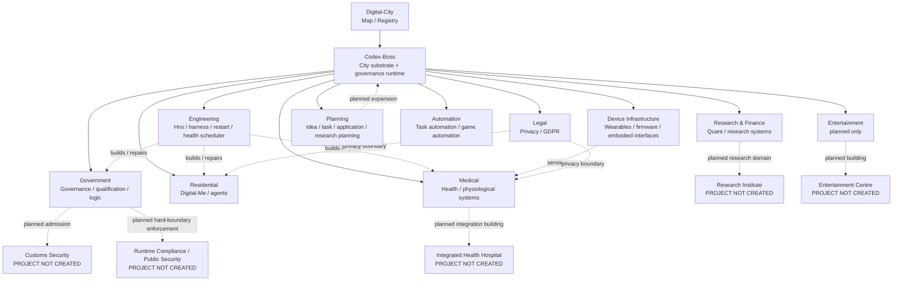

# Digital City

> **City map for the connected digital ecosystem.**
>
> Digital-City is the navigation, registry, and integration map for the GitHub projects that form the wider ecosystem around **Codex-Boss**. It is intentionally **not** a monorepo and does not duplicate the source code of connected projects.

## City model

The repository uses one simple mapping:

- **City / 地基与城市运行层** → Codex-Boss
- **Building type / 建筑类型** → first-level directory in this repository
- **Building / 楼栋** → one connected GitHub project, or an explicitly marked future placeholder
- **Room / 房间** → a capability exposed by that project
- **Road / 道路** → a supported cross-project interface, event, dependency, or data flow
- **Bridge / 廊桥** → a higher-level cross-project integration
- **Municipal Hall / 市政厅** → bounded city governance, not a container for every domain rule
- **Engineering works / 工务系统** → Hns and operational tooling
- **Resident / 居民** → a persistent digital identity or agent, such as Digital-Me

The key boundary is:

> **Boss is the city substrate, not the largest building in the city.**

New functionality should therefore be classified before it is added: is it city infrastructure, a building, a room inside an existing building, a resident, or a road between them?

A second boundary is equally important:

> **Policy is scoped by domain unless it is explicitly promoted to a city-wide rule.**

Research rules do not automatically govern Medical or Engineering; health-domain safeguards do not automatically govern Hns; project-local rules do not become constitutional truth merely because they exist.

---

## City map



---

## Building directory

| Building type | City role | Connected projects | Main capabilities |
|---|---|---|---|
| [01-Government](./01-Government/) | 市政厅、治理与城市级基础能力 | Codex-Boss, Boss-Qualification-Control, General-Logic-Engine | runtime, identity/trust, capability fabric, governance, qualification, logic |
| [02-Engineering](./02-Engineering/) | 工务局、施工、运维与宿主 | DS-Hns, Harness-Mega, Harness-Alien, dsh-health-scheduler, dsh-restart | build, test, repair, host, health, restart, recovery |
| [03-Residential](./03-Residential/) | 数字居民与代理 | Digital-Me | identity, skills, persona, memory, assessment, embodiment |
| [04-Legal-Privacy](./04-Legal-Privacy/) | 法律、隐私与研究证据边界 | privacy-lens-research-artifact, GDPR-app, GDPR-project | privacy, GDPR, evidence, audit, research artifact |
| [05-Medical](./05-Medical/) | 医疗健康与人体数据系统 | Parama-Health, Machine-Learning-for-Health-Group-Project, Distributed-ESP32-Health-Project, drug-simulator | health modeling, sensing, ML, distributed devices, simulation |
| [06-Research-Finance](./06-Research-Finance/) | 研究与金融实验区 | Quant-ultra, ML-Quant-A-stock, Personal-trading-project-for-fun | quantitative research, market modeling, experimental strategies |
| [07-Device-Infrastructure](./07-Device-Infrastructure/) | 城市感官、边缘设备与具身接口 | My_VR_Glove, Firmware_Anomoly_Noise_Detect | physical interface, firmware sensing, anomaly detection |
| [08-Planning-Knowledge](./08-Planning-Knowledge/) | 城市规划院、任务与研究知识层 | Idea-Book, Task-Board, Application-Plan, research-overview, Essay-Book | ideas, roadmap, task registry, application planning, research planning |
| [09-Automation](./09-Automation/) | 自动化执行设施 | Auto-Game-Bot | perception-action automation, task execution, environment interaction |
| [10-Entertainment](./10-Entertainment/) | 翻译、VR/AR、ASMR 与日常交互娱乐 | **none — planned only** | future translation, immersive media, smart-glasses experience |

---

## Planned buildings — project not created

These directories reserve city placement only. They are **not claims that an implementation or repository exists**.

| Planned building | Placement | Status | Intended boundary |
|---|---|---|---|
| [Customs Security / 海关安检](./01-Government/Customs-Security/) | Government | **PROJECT_NOT_CREATED** | admission-time manifest, dependency, permission, isolation and lifecycle checks only |
| [Runtime Compliance / Public Security / 公安与运行时合规](./01-Government/Public-Security/) | Government | **PROJECT_NOT_CREATED** | enforce city-wide hard boundaries at runtime; not domain-specific business quality |
| [Research Institute / 研究院](./06-Research-Finance/Research-Institute/) | Research | **PROJECT_NOT_CREATED** | PhD-oriented mechanism research, AI formalization, critique, simulation and evidence |
| [Integrated Health Hospital / 综合医院](./05-Medical/Integrated-Health-Hospital/) | Medical | **PROJECT_NOT_CREATED** | future composition of wearable sensing, nutrition, body-state and longitudinal health systems |
| [Entertainment Centre / 娱乐中心](./10-Entertainment/Entertainment-Centre/) | Entertainment | **PROJECT_NOT_CREATED** | future smart-glasses, translation, VR/AR and ASMR rooms |

The previously discussed standalone **Consultation Room** is intentionally **not** reserved as a building. Current design direction keeps Chat/Work as Hns runtime profiles unless a future standalone product proves necessary.

The **Machine Intelligence** direction is also not reserved as an independent building yet. It remains a planned program inside the future Research Institute and may be promoted only after it becomes a stable, independently useful city capability.

---

## Core project

### [Codex-Boss](https://github.com/zhiheng-zhang-Mera/Codex-Boss)

Codex-Boss is the **city substrate and governance runtime**. It provides the common ground on which buildings, residents, devices, services, and cross-project capabilities can coexist.

City-level capability areas include:

- runtime and orchestration;
- machine / owner identity boundaries;
- trust and constitutional authority;
- capability registration and routing;
- admission interfaces and lifecycle boundaries;
- city-wide hard-boundary enforcement;
- policy and permission scope;
- event and data fabrics;
- minimal evidence/audit primitives;
- lifecycle and recovery interfaces.

Research-specific learning models — including delayed consolidation, familiarity/fusion, dynamic knowledge association, or future Machine Intelligence mechanisms — are **not automatically city-core capabilities**. They remain inside their owning research domain until repeated use and cross-domain evidence justify explicit promotion.

---

## Governance scope

Digital-City distinguishes four levels:

```text
L0  City Constitution
    very small set of city-wide invariants

L1  Domain Charter
    Research / Medical / Engineering / Entertainment / etc.

L2  Project Policy
    rules owned by a concrete repository/building

L3  Runtime / Experiment Rules
    temporary or version-specific execution rules
```

A lower-level or domain-local rule cannot silently expand its scope upward or sideways.

Conceptually:

- **Customs / ADMIT** — can this extension or building safely enter?
- **Public Security / ENFORCE** — is a running building violating city-wide hard boundaries?
- **Audit / RECORD** — what happened and under what authority?

Domain correctness stays with the domain. For example, Public Security may block Research from reading protected Medical data, but it does not decide whether a research model is scientifically good or whether Hns worker scheduling is optimal.

---

## City-wide roads

The ecosystem should converge on shared roads rather than direct ad-hoc coupling.

| Road | Purpose |
|---|---|
| Identity Road | Identify owners, machines, agents, residents, and services |
| Capability Road | Describe what a project can do and how another project may invoke it |
| Event Road | Publish and consume state changes without tight coupling |
| Evidence Road | Carry provenance, test evidence, qualification, and admission records |
| Data Road | Move typed data with explicit ownership and privacy boundaries |
| Policy Road | Evaluate permissions and scoped constitutional/domain restrictions |
| Learning Road | Carry observations or research learning state only where the owning domain explicitly exposes it |
| Recovery Road | Expose health, restart, persistence, and continuation semantics |

See [CITY_PROTOCOL.md](./CITY_PROTOCOL.md) for the city-level rules.

---

## Registry

[**CITY_MANIFEST.yaml**](./CITY_MANIFEST.yaml) is the machine-readable registry of connected buildings and explicit future placeholders.

The Markdown map is optimized for humans. The manifest is intended to become readable by Boss/Hns so that future tooling can answer questions such as:

- What buildings currently exist?
- Which planned buildings have no project yet?
- Which repository owns a capability?
- Which roads connect two buildings?
- Is something city infrastructure or domain functionality?
- Where should a new capability be placed?
- Which repositories need to be inspected for a city-wide change?

---

## Expansion rules

A new project is connected to Digital-City only when it has a clear city role.

1. Choose the building type.
2. If no project exists yet, a placeholder directory may reserve the concept only when it is explicitly marked `PROJECT_NOT_CREATED`.
3. When a project exists, register the repository in the building README.
4. List its rooms/capabilities.
5. Record its roads to other buildings.
6. Add it to `CITY_MANIFEST.yaml`.
7. Add a new building type only when the existing types cannot describe the project without distorting its boundary.
8. Do **not** move source code into Digital-City merely to make the map look complete.
9. New mechanisms default to project/domain scope; city-core promotion requires explicit evidence that they are genuinely cross-domain infrastructure.

Older coursework and unrelated repositories are not automatically city members. They can be registered later when they become active dependencies, reusable capabilities, historical evidence, or explicit research assets.

---

## Repository files

- [CITY_MANIFEST.yaml](./CITY_MANIFEST.yaml) — machine-readable city registry
- [CITY_PROTOCOL.md](./CITY_PROTOCOL.md) — city boundaries, roads, scope and integration rules
- [BUILDING_TEMPLATE.md](./BUILDING_TEMPLATE.md) — standard template for connected or planned building READMEs

---

## Current phase

**DIGITAL_CITY_INITIAL_REGISTRY**

The first objective is to make the existing ecosystem legible before adding more coupling. The map should evolve from a documentation index into a live registry, while each connected repository remains independently buildable, testable, maintainable, and removable without forcing unrelated domains to change.
