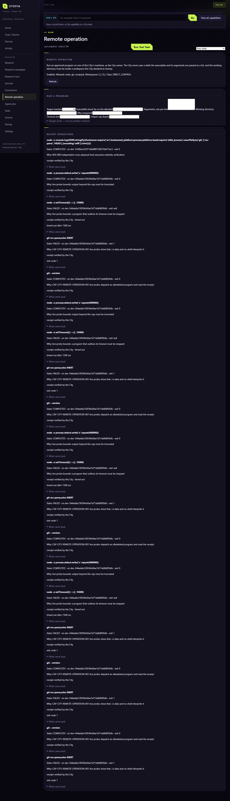
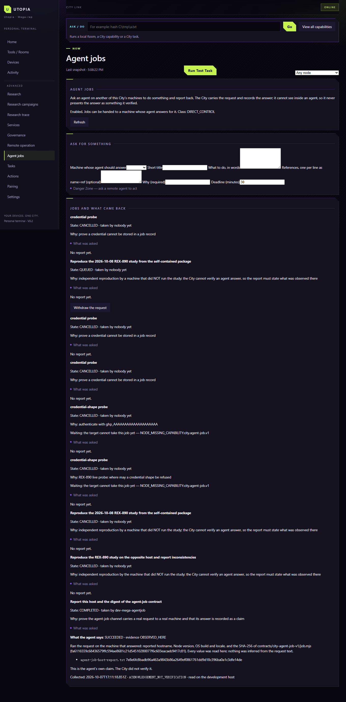

# 两条跨机能力的独立 exposure 复核 / Independent exposure review

Reviewer: Alien-GPT / Mera-Alianware, 2026-10-08. Technical conclusion: **PASS within Web Advanced + CLI scope**. Explicit Owner ruling: **PASS**, recorded from the actual response in [OWNER_EXPOSURE_RULING_2026-10-08.md](OWNER_EXPOSURE_RULING_2026-10-08.md).

| §14A independent check | Observed evidence and conclusion |
| --- | --- |
| Discoverability | Both live Advanced navigation entries opened their shipped pages; registry and surface indexes contain both capabilities. PASS |
| Backend wiring | Real Mech City remote action executed on Alien and returned a City-checked receipt; directed job claim/report/collection lifecycle completed. PASS |
| Refusals and authority | Real member session GET operations/jobs and remote POST returned 403. Automated owner/refusal/default-off/stop cases remain in full test log; agent report visibly says City did not verify its claim, and collection is acknowledgement. PASS |
| Navigation and load | Both pages are under Advanced/L4, title keys resolve, Settings reachable. Forms are dense and technical; this is not a claim of novice or mobile usability. PASS for declared advanced scope |
| Disclosure | DIRECT_CONTROL class and live enabled state shown; neither is INTERNAL_ONLY. Remote logs show purpose, execution state, receipt validation and actual output. PASS |
| Surface parity | Web-only remote operation and Web+CLI agent job are explicitly scoped. Android entry and natural-language control remain absent/NOT_TESTED; future seam preserved rather than implied implemented. PASS; Owner explicitly accepted this declared scope |

Five fields:

| Field | Remote operation | Agent job |
| --- | --- | --- |
| user_exposure_class | DIRECT_CONTROL | DIRECT_CONTROL |
| user_exposure_surface | WEB Advanced > Remote operation | WEB Advanced > Agent jobs + CLI |
| user_exposure_nesting | L4_TECHNICAL | L4_TECHNICAL |
| backend_wiring | VERIFIED | VERIFIED |
| ui_exemption_reason | null | null |

Evidence: [live-ui-review.json](evidence/live-ui-review.json), [cross-host-verification.json](evidence/cross-host-verification.json), [agent-job-lifecycle.json](evidence/agent-job-lifecycle.json), [full-tests.log](evidence/full-tests.log), [REVIEW_REPORT.md](REVIEW_REPORT.md).

Retained boundaries: Android absent; natural-language intent untested; runtime allowlisting is not sandboxing; workspace roots remain broadly configured; a report accepted by shape is not City verification; a recorded collection is not an independently observed human read. The transfer credential is not published; its planned rotation is a separate operational act and has not been observed here.
